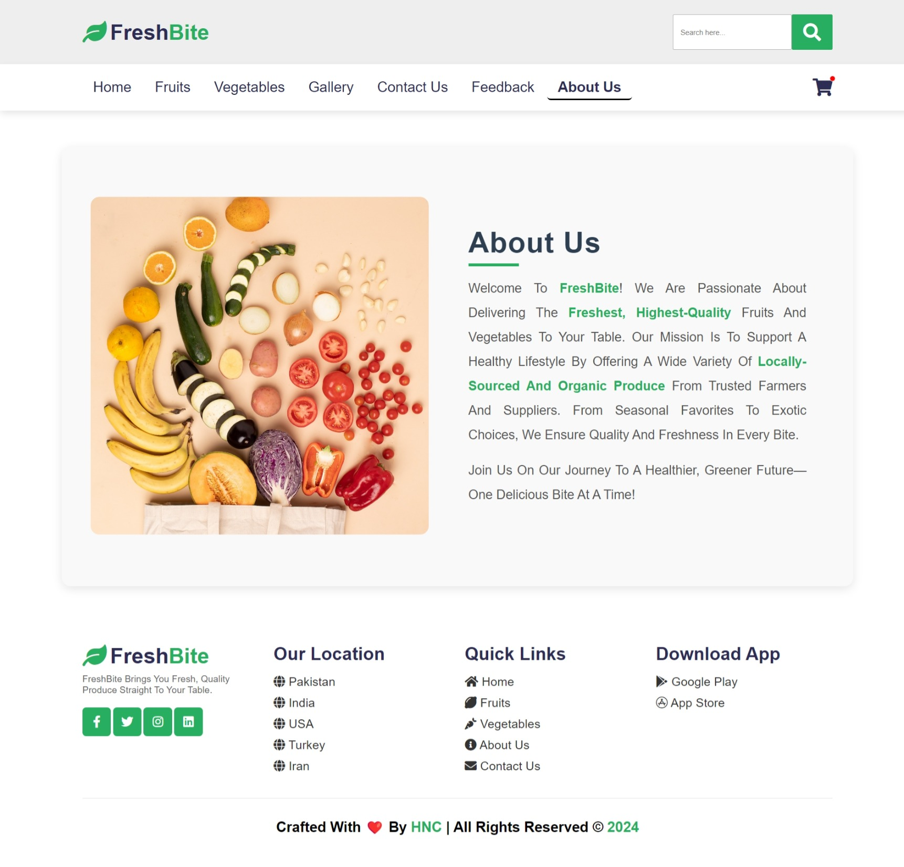
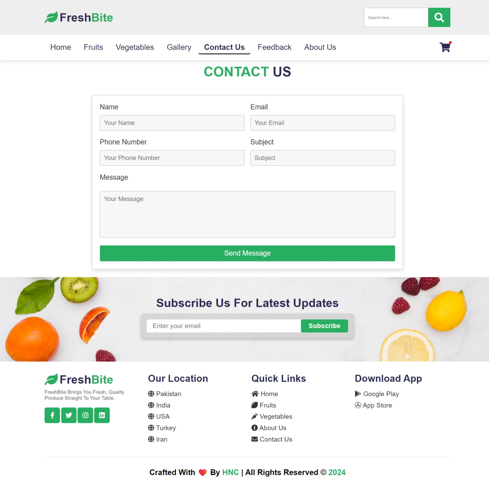

# Responsive Website

A responsive website designed using HTML, CSS, and JavaScript, featuring an interactive and user-friendly interface.

## Features

- Fully responsive layout
- Clean and modern design
- JavaScript-based interactive features

## Technologies Used

- HTML
- CSS
- JavaScript

## Screenshots

Here are some screenshots of the website:

### Homepage


### About Page



### Contact Page



## How to Use

1. Clone this repository:
   ```bash
   git clone https://github.com/Hassan-Nisar-Ch/FreshBite.git
   ```
2. Navigate to the project folder.
3. Open `home.html` in a browser.

## Contributing

Contributions are welcome! Please fork this repository and submit a pull request.

## License

This project is licensed under the MIT License. See the [LICENSE](/LICENSE) file for details.
